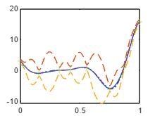
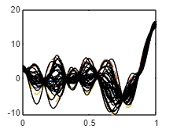
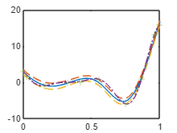

There are currently 3 defined kernel types:

EQ - exponential Quadratic (SE squared exponential)

RQ - Rational Quadratic (alpha=1)

Matern52

These kernels can be added subtracted multiplied and divided

  

The GP class takes a mean function and a kernel.

  

it then can be conditioned on data x and y and can then be trained using mean aposteriori HP selection.

```matlab:Code
clear all
%close all
clc

f1 = @(x) (6*x-2).^2.*sin(12*x-4);

xx = linspace(0,1,100)';
yy = f1(xx);

x1 = [0; 1*lhsdesign(8,1);1];
y1 = f1(x1);

a = (Matern52(1,0.2) + EQ(0.2,0.4))*RQ(1,0.1);

a.signn = 0.2;
```

```matlab:Code
Z = GP([],a);
```

```matlab:Code
Z1 = Z.condition(x1,y1);

[ys,sig] = Z1.eval(xx);

figure(2)
clf(2)
plot(xx,ys)
hold on
plot(xx,ys+2*sqrt(sig),'--')
plot(xx,ys-2*sqrt(sig),'--')
plot(xx,yy,'-.')
plot(x1,y1,'+')
```



```matlab:Code

```

```matlab:Code
figure(4)
plot(xx,ys)
hold on
plot(xx,ys+2*sqrt(sig),'--')
plot(xx,ys-2*sqrt(sig),'--')

for i = 1:30
    ysamp = Z1.samplePosterior(xx);
    plot(xx,ysamp,'LineWidth',0.05,'Color','k')
end
```



```matlab:Code
tic
[Z2] = Z1.train();
toc
```

```text:Output
Elapsed time is 0.593151 seconds.
```

```matlab:Code
[ys,sig] = Z2.eval(xx);

figure(3)
clf(3)
plot(xx,ys)
hold on
plot(xx,ys+2*sqrt(sig),'--')
plot(xx,ys-2*sqrt(sig),'--')
plot(xx,yy,'-.')
plot(x1,y1,'+')
```


