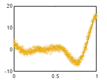
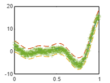
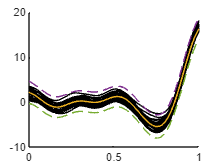

Variational Gaussian Process

takes a mean function a kernel object and a list of inducing points

Training uses a mini-batch stochastic optimization.

```matlab:Code
clear all
%close all
clc

f1 = @(x) (6*x-2).^2.*sin(12*x-4);

xx = linspace(0,1,100)';
yy = f1(xx);

x1 = lhsdesign(500,1);
y1 = f1(x1);
y1 = y1 + normrnd(0,0*y1 + 0.8);

a = Matern52(1,0.2)*EQ(1,0.4).periodic(1,2) + RQ(0.1,0.3);
```

```matlab:Code
a.signn = 0.5;

Z = VGP([],a,lhsdesign(8,1));
```

```matlab:Code
Z1 = Z.condition(x1,y1);

[ys,sig] = Z1.eval(xx);

figure(2)
clf(2)
plot(xx,ys)
hold on
% plot(xx,ys+2*sqrt(sig),'--')
% plot(xx,ys-2*sqrt(sig),'--')
plot(xx,yy,'-.')
plot(x1,y1,'+')
```



```matlab:Code
tic
[Z2,LL] = Z1.train(1);
```

```text:Output
Variables (index) internally transformed to log coordinates: [1 2 3 4].
Beginning optimization of a STOCHASTIC objective fcn.

Optimization terminated: mesh size less than OPTIONS.TolMesh.
Estimated function value at minimum: 24.6392 +/- 0.605676 (mean +/- SEM from 10 samples).

Variables (index) internally transformed to log coordinates: [1 2 3 4].
Beginning optimization of a STOCHASTIC objective fcn.

Optimization terminated: mesh size less than OPTIONS.TolMesh.
Estimated function value at minimum: 26.4603 +/- 0.481208 (mean +/- SEM from 10 samples).

Variables (index) internally transformed to log coordinates: [1 2 3 4].
Beginning optimization of a STOCHASTIC objective fcn.

Optimization terminated: mesh size less than OPTIONS.TolMesh.
Estimated function value at minimum: 27.7985 +/- 1.43034 (mean +/- SEM from 10 samples).
```

```matlab:Code
toc
```

```text:Output
Elapsed time is 23.725120 seconds.
```

```matlab:Code
[ys,sig] = Z2.eval(xx);

figure(3)
clf(3)
plot(xx,ys)
hold on
plot(xx,ys+2*sqrt(sig),'--')
plot(xx,ys-2*sqrt(sig),'--')
plot(xx,yy,'-.')
plot(x1,y1,'+')
```



```matlab:Code
figure(4)
hold on
for i = 1:30
    ysamp = Z1.samplePosterior(xx);
    plot(xx,ysamp,'LineWidth',0.05,'Color','k')
end

plot(xx,ys)
plot(xx,ys+2*sqrt(sig),'--')
plot(xx,ys-2*sqrt(sig),'--')
```


