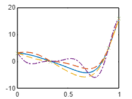
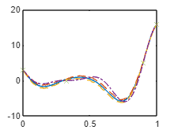
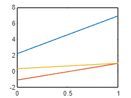

Multi-Fidelity GP model

Takes a list of GPs as an input and a mean function and a kernel object

```matlab:Code
clear all
close all
clc

A = 0.5; B = 10; C = -5;
ff{1} = @(x) (6*x-2).^2.*sin(12*x-4);
ff{2} = @(x) 0.4*ff{1}(x)-x-1;
ff{3} = @(x) A*ff{1}(x)+B*(x-0.5)-C; 

xx = linspace(0,1,100)';
yy = ff{1}(xx);

x{1} = [0; lhsdesign(2,1);1];
y{1} = ff{1}(x{1});

for i = 2:3
x{i} = [x{i-1}; lhsdesign(5,1)];
y{i} = ff{i}(x{i});
end

ma = means.linear(4) + means.const(1);

a = kernels.Matern52(1,0.2)+kernels.RQ(0.1,0.5);
b = kernels.EQ(1,0.3);
```

```matlab:Code
for i = 1:3
    Z{i} = GP(ma,a);
    Z{i} = Z{i}|[x{i} y{i}];
    Z{i} = Z{i}.train;
end
```

```matlab:Code
MF = MFGP(Z,ma,b);
```

```matlab:Code
[ys,sig] = Z{1}.eval(xx);

figure(2)
clf(2)
plot(xx,ys)
hold on
plot(xx,ys+2*sqrt(sig),'--')
plot(xx,ys-2*sqrt(sig),'--')
plot(xx,yy,'-.')
plot(x{1},y{1},'x')
```



```matlab:Code
[ys,sig] = MF.eval(xx);

figure(3)
clf(3)
plot(xx,ys)
hold on
plot(xx,ys+2*sqrt(sig),'--')
plot(xx,ys-2*sqrt(sig),'--')
plot(xx,yy,'-.')
plot(x{1},y{1},'x')
```



```matlab:Code

```

```matlab:Code
ym2 = MF.Zd{2}.mean.eval(xx);
ym3 = MF.Zd{3}.mean.eval(xx);

figure
plot(xx,ym2)
hold on
plot(xx,ym3)
```


```matlab:Code

ym1 = MF.GPs{1}.mean.eval(xx);
ym2 = MF.GPs{2}.mean.eval(xx);
ym3 = MF.GPs{3}.mean.eval(xx);

figure
plot(xx,ym1)
hold on
plot(xx,ym2)
plot(xx,ym3)
```



```matlab:Code

```
