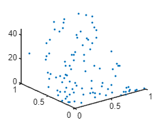

The mean super class allows addition subtraction multiplication and division.

```matlab:Code
clear all
close all
clc

xx = lhsdesign(100,2);

a = means.const(3);

b = means.linear([1 2]);

c = means.linear([-0.1 3]);

d = (c+a)*b*c;

K = d.eval(xx);

figure(1)
clf(1)
plot3(xx(:,1),xx(:,2),K,'.')
```



```matlab:Code

```

```matlab:Code
V = d.getHPs()
```

```text:Output
V = 1x7    
   -0.1000    3.0000    3.0000    1.0000    2.0000   -0.1000    3.0000

```

```matlab:Code

d = d.setHPs(V+1);
```
