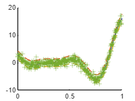
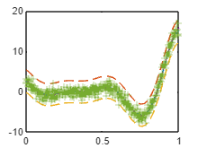

Variational Gaussian Process

takes a mean function a kernel object and a list of inducing points

Training uses a mini-batch stochastic optimization.

```matlab:Code
clear all
%close all
clc

f1 = @(x) (6*x-2).^2.*sin(12*x-4);

xx = linspace(0,1,100)';
yy = f1(xx);

x1 = lhsdesign(500,1);
y1 = f1(x1);
y1 = y1 + normrnd(0,0*y1 + 0.8);

ma = means.const(2)+means.linear(6);
a = kernels.Matern52(1,0.2)*kernels.EQ(1,0.4).periodic(1,2) + kernels.RQ(0.1,0.3);
```

```matlab:Code
a.signn = 0.5;

Z = VGP(ma,a,lhsdesign(15,1));
```

```matlab:Code
Z1 = Z.condition(x1,y1);

[ys,sig] = Z1.eval(xx);

figure
hold on
plot(xx,ys)
plot(xx,ys+2*sqrt(sig),'--')
plot(xx,ys-2*sqrt(sig),'--')
plot(xx,yy,'-.')
plot(x1,y1,'+')
```



```matlab:Code
tic
[Z2,LL] = Z1.train();
```

```text:Output
Variables (index) internally transformed to log coordinates: [3 4 5].
Beginning optimization of a STOCHASTIC objective fcn.

Optimization terminated: mesh size less than OPTIONS.TolMesh.
Estimated function value at minimum: 25.8595 +/- 0.415588 (mean +/- SEM from 10 samples).

Variables (index) internally transformed to log coordinates: [3 4 5].
Beginning optimization of a STOCHASTIC objective fcn.

Optimization terminated: mesh size less than OPTIONS.TolMesh.
Estimated function value at minimum: 28.8236 +/- 0.988327 (mean +/- SEM from 10 samples).

Variables (index) internally transformed to log coordinates: [3 4 5].
Beginning optimization of a STOCHASTIC objective fcn.

Optimization terminated: mesh size less than OPTIONS.TolMesh.
Estimated function value at minimum: 27.6798 +/- 0.907458 (mean +/- SEM from 10 samples).
```

```matlab:Code
toc
```

```text:Output
Elapsed time is 47.344382 seconds.
```

```matlab:Code
[ys,sig] = Z2.eval(xx);

figure
plot(xx,ys)
hold on
plot(xx,ys+2*sqrt(sig),'--')
plot(xx,ys-2*sqrt(sig),'--')
plot(xx,yy,'-.')
plot(x1,y1,'+')
```


