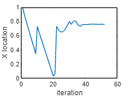
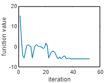
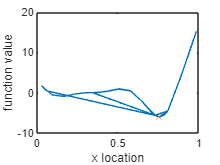

An implementation of the variational stochastic gradient descent algorithm for noisy gradient evaluations.

Added reflective boundaries to allow constrained optimization 

```matlab:Code
x0 = rand();

[x,Fx,xv,fv] = VSGD(@(x) forr(x),x0,'lr',0.1,'lb',0,'ub',1,'gamma',0.01,'iters',2000,'tol',1*10^(-5));

figure
plot(xv)
xlabel('iteration')
ylabel('X location')
```



```matlab:Code

figure
plot(fv)
xlabel('iteration')
ylabel('function value')
```



```matlab:Code

figure
plot(xv,fv)
hold on
plot(x,Fx,'X')

xlabel('x location')
ylabel('function value')
```



```matlab:Code

```

```matlab:Code
function [y,dy] = forr(x)

y = ((6*x-2).^2).*sin(12*x-4);
dy =12*(6*x-2).*(sin(12*x-4) + (6*x-2).*cos(12*x-4)) + normrnd(0*x,1);

end
```
