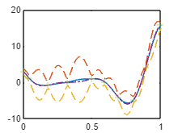
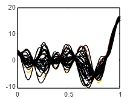
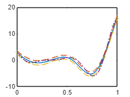

# MatlabGP
flexible GP model with user friendly kernel construction inspired by STHENO.

--------------------------------------------------------------------------------------------------------------------------------------------------------

+kernels
  - EQ - squared exponential
  - RQ - rational quadratic
  - Matern52
  - Lin - Linear
  - GE - Gaussian Envelope

+means
  - zero
  - linear
  - sine
  - const

--------------------------------------------------------------------------------------------------------------------------------------------------------

GP - Exact GP with gaussian likelihood

VGP - Variational GP with gaussian likelihood

MFGP - An AR(1) multi-fidelity GP using Le Gratiet simplification (nF Cov matrices rather than 1 large Cov matrix)

--------------------------------------------------------------------------------------------------------------------------------------------------------

Means can be added or multiplied together or divided. Kernels can be added or multiplied.

GP and MFGP models find hyperparameters via the mean of the posterior.

VGP finds the hyperparameters as MAP point values. This uses the BADS (bayesian adaptive direct search) package.

--------------------------------------------------------------------------------------------------------------------------------------------------------

WIP:
 -Analytical gradients for all hyperparameters. All HPs will be found using VSGD (variational stochastic gradient decent) if number of HPs is large.

--------------------------------------------------------------------------------------------------------------------------------------------------------
Example:

```matlab:Code
clear all
%close all
clc

f1 = @(x) (6*x-2).^2.*sin(12*x-4);

xx = linspace(0,1,100)';
yy = f1(xx);

x1 = [0; 1*lhsdesign(8,1);1];
y1 = f1(x1);
```

```matlab:Code
a = means.const(2) + means.linear(4);

b = (kernels.Matern52(1,0.2) + kernels.EQ(0.2,0.4))*kernels.RQ(1,0.1);
b.signn = 0.2;
```

```matlab:Code
Z = GP(a,b);
```

```matlab:Code
Z1 = Z.condition(x1,y1);

[ys,sig] = Z1.eval(xx);

figure(2)
clf(2)
plot(xx,ys)
hold on
plot(xx,ys+2*sqrt(sig),'--')
plot(xx,ys-2*sqrt(sig),'--')
plot(xx,yy,'-.')
plot(x1,y1,'+')
```



```matlab:Code
figure(4)
plot(xx,ys)
hold on
plot(xx,ys+2*sqrt(sig),'--')
plot(xx,ys-2*sqrt(sig),'--')

for i = 1:30
    ysamp = Z1.samplePosterior(xx);
    plot(xx,ysamp,'LineWidth',0.05,'Color','k')
end
```



```matlab:Code
tic
[Z2] = Z1.train();
toc
```

```text:Output
Elapsed time is 1.141292 seconds.
```

```matlab:Code
[ys,sig] = Z2.eval(xx);

figure(3)
clf(3)
plot(xx,ys)
hold on
plot(xx,ys+2*sqrt(sig),'--')
plot(xx,ys-2*sqrt(sig),'--')
plot(xx,yy,'-.')
plot(x1,y1,'+')
```


